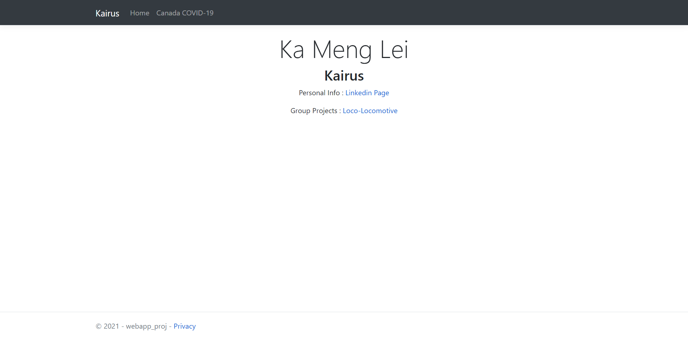
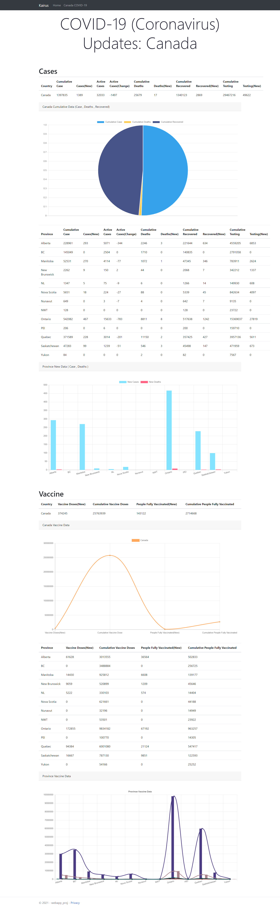

# COVID-Status-Dashboard : HTML/CSS, C#
- Applied Model View Controller pattern to manage to communicate between front-end and web service back-end.

- A simple home page that has links to my LinkedIn page and group project page.

- LinkedIn page :  https://www.linkedin.com/in/ka-meng-kairus-lei-279194bb/

- Group project page :  https://rhainyleo.itch.io/loco-locomotive 

- Utilized COVID-19 Canada Open Data Working Group API (https://opencovid.ca/api) to retrieve real-time stats including reported cases and vaccine status. 

